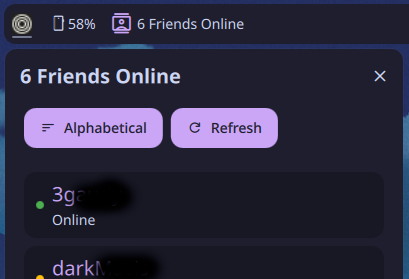

# STEAM Friends
A dankbar widget to show the number of friends online and a popout to tell you who!

## Screenshot

## Features
- Sort by status or by user name
- Shows which friends are online and their status
- If in a game, show which game

## Installation
Very easy, just do one of the following:
- Go to [danklinux.com/plugins](https://danklinux.com/plugins) and search for it, then click 'Install'
- Open DMS settings > plugins > browse > seach > Install
- On the GitHub page > Code > Download Zip > extract it to: ~/.config/DankMaterialShell/plugins

## Setup
Your going to need two things fore this to work:
- Steam API - You can get your own Steam API key from here: [Steam API](https://steamcommunity.com/dev)
- Steam ID - You can findout your Steam ID here: [Steam ID](https://steamid.io/) Then enter both of these in the Steam Friends Plugin on the DMS settings.

## Author
Created by banicans

## Links
- [DankMaterialShell](https://github.com/AvengeMedia/DankMaterialShell)
- [Steam API](https://steamcommunity.com/dev)
- [Steam ID](https://steamid.io/ )