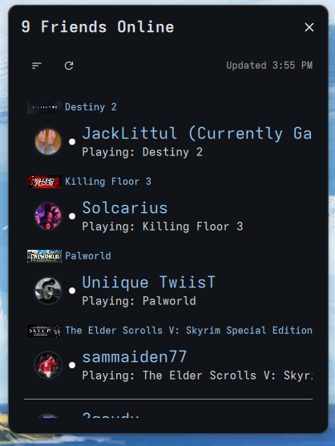

# Steam Friends
A dankbar widget to show the number of friends online and a popout to tell you who!

## Screenshot

## Features
- Sort by status or by user name, with an icon-only sort/refresh toolbar
- Shows which friends are online and their status (Online, Away, Busy, Snooze, Looking to Trade, Looking to Play), each with its own colored status dot
- If in a game, shows which game, with friends grouped by game when sorted by status
- Game group headers show the game's Steam capsule art and are clickable, opening that game's store page
- Friend avatars shown next to each entry
- Click a friend to open a Steam chat with them
- "Last updated" timestamp shown in the popout
- Optional toggle to show/hide the "Friends Online" text in the bar, leaving just the icon and count
- Clear error banner shown in the popout if a fetch fails (bad API key, network issue, etc.) instead of silently showing nothing

## Installation
Very easy, just do one of the following:
- Go to [danklinux.com/plugins](https://danklinux.com/plugins) and search for it, then click 'Install'
- Open DMS settings > plugins > browse > seach > Install
- On the GitHub page > Code > Download Zip > extract it to: ~/.config/DankMaterialShell/plugins

## Setup
Your going to need two things for this to work:
- Steam API - You can get your own Steam API key from here: [Steam API](https://steamcommunity.com/dev)
- Steam ID - You can findout your Steam ID here: [Steam ID](https://steamid.io/) Then enter both of these in the Steam Friends Plugin on the DMS settings.
- Now open DMS settings > plugins > then enter the API and ID into the Steam Friends plugin settings

## Author
Created by banicans

## Links
- [DankMaterialShell](https://github.com/AvengeMedia/DankMaterialShell)
- [Steam API](https://steamcommunity.com/dev)
- [Steam ID](https://steamid.io/ )
